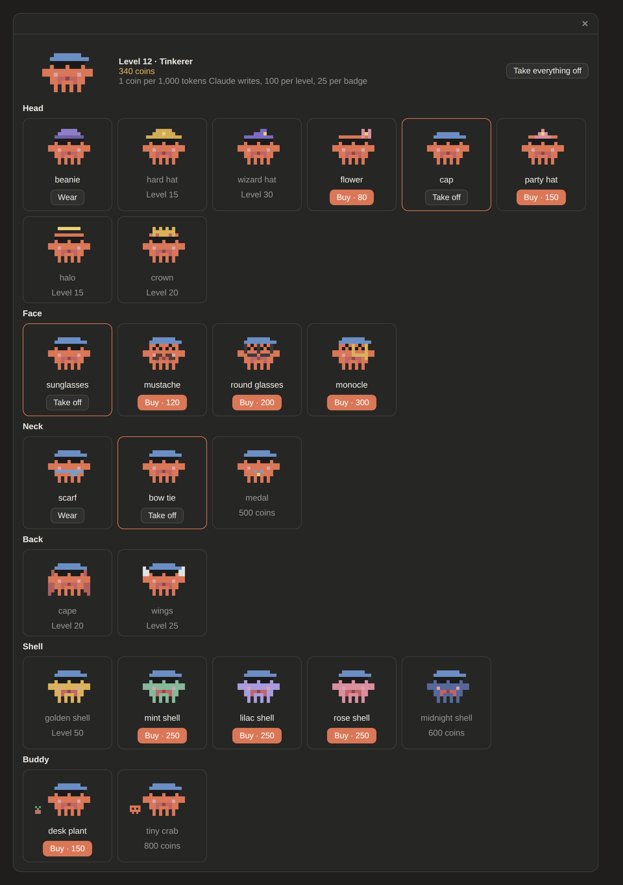
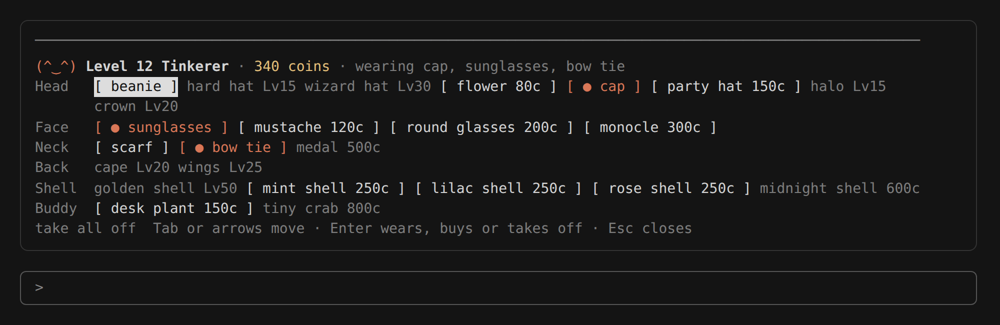

<p align="center">
  
</p>

<p align="center">
  
  
  
  <a href="LICENSE"></a>
  <a href="https://github.com/lucassimzq"></a>
</p>

Keep your context window, 5-hour session limit and weekly limit in view above the Claude Code prompt, with no menu to open. A little pixel crab sits beside them, doing his own thing, and gets more nervous the closer you get to a limit. He also levels up as you work, keeps your streak, and spends the coins you earn on hats.

> This is an unofficial fan project, not affiliated with or endorsed by Anthropic. Claude and Claude Code are trademarks of Anthropic, and the pixel crab is fan art of their mascot.

## How it looks

The crab's mood follows whichever of the three numbers is highest.

**Under 50%: happy.** Headphones on, tapping a foot, music notes drifting up.


**50% and up: anxious.** Nervously sipping coffee, with a note saying which limit is filling up.


**80% and up: frantic.** Watching the clock tick.


**95% and up: this is fine.** Coffee in hand, flames either side.


**100%: asleep** until the limit resets, and the note says when.


While Claude works, the crab joins in: a thought bubble while Claude thinks, and a little laptop while it writes or uses tools.

### Reading the band

- **`ctx`**: how full the context window is.
- **`5h`** and **`7d`**: your session and weekly plan limits. The small arrow above each bar marks how far through that window you are; a bar past its arrow is using the limit faster than the clock.
- **Colors**: green under 50%, amber from 50%, red from 80%.
- **`$`**: what this session has cost so far.
- **`↻`**: re-reads the figures right away.

You also get a short pop-up when a limit passes 50%, 80% or 95%.

## Levels

The crab earns XP as you work and levels up. The level, a thin bar toward the next one, your coin balance and your daily streak sit beside him.


- **XP:** 10 per turn (2 after your first 60 of the day), 25 for the first turn of each day, and 5 per point your weekly limit rises.
- **Pacing pays:** a 5-hour window that peaks at 60–99% earns 100 XP, one at 30–59% earns 40.
- **Maxing out pays too:** the moment a limit reaches 100% you get 60 XP for the 5-hour window or 150 for the weekly one, once per window.
- **Streaks:** each day with a turn adds one. Every 7 days earns a rest day (you can hold 2), which covers a day off.
- **Badges:** thirteen to find, like Close Call (a week that peaked at 95–99%), Maxed Out, Zen (a week under 50%) and Night Owl. Each is worth 50 XP.
- **Unlocks:** a scarf at level 3, then a beanie (5), sunglasses (10), a hard hat (15), a cape (20), a wizard hat (30) and a golden shell (50). The newest unlock goes on by itself, unless you picked something else for that slot or took it off.

Level `L` needs `50 × L × (L − 1)` XP in all, so daily use reaches level 10 in about a week and level 50 in about seven months. Progress counts from when you install the mod and is shared by all your sessions and projects. (Two sessions finishing a turn in the very same instant can drop one turn's XP; the store has no atomic update.)


## The shop

Tokens become coins: 1 for every 1,000 tokens Claude writes, plus 100 per level-up and 25 per badge. Your balance sits under the level in the band (`1.2k` past a thousand). Spend them in the shop on things for the crab to wear.


The crab has seven slots, so outfits mix: **head** (flower, cap, party hat, halo, crown), **face** (mustache, round glasses, monocle), **neck** (bow tie, medal), **back** (wings), **shell** (mint, lilac, rose, midnight), a **buddy** beside him (desk plant, tiny crab) and a **backdrop** behind him (forest, beach, city at night, Australia, Malaysia, space). Backdrops show on the desktop, VS Code and mobile bands; the terminal has no room for one. Prices run from 50 to 2,000 coins, and the fanciest items also need a minimum level. Level unlocks stay free and fill their slots until you pick something else.

`/usage-hud shop` opens it as a panel you click through: every item in its slot, with the crab trying it on. Press a card to buy it, put it on or take it off. It also fits a narrow sidebar, where the header stacks under the crab.

<p align="center">
  
</p>

In the terminal the same panel is a row of buttons per slot: Tab or the arrows move, Enter presses, Esc closes.



## Install

Clone the repo:

```bash
git clone https://github.com/lucassimzq/claude-usage-mod.git ~/claude-usage-mod
```

To load it in every session, including the desktop app, add it to the `env` block of `~/.claude/settings.json`:

```json
{
  "env": {
    "CLAUDE_CODE_PLUGIN_DIRS": "~/claude-usage-mod",
    "CLAUDE_CODE_PLUGIN_DIR_WATCH": "1"
  }
}
```

`CLAUDE_CODE_PLUGIN_DIR_WATCH` lets the desktop app pick up an update without a restart; the terminal does that on its own.

Or try it for a single terminal session:

```bash
claude --plugin-dir ~/claude-usage-mod
```

The band shows in the terminal and in the desktop app's Code tab. It is built to draw in Claude Code for VS Code and the Claude mobile app too, wherever they show a band above the prompt, but it hasn't been tried there yet; if you do, please open an issue and say how it went. It doesn't show on claude.ai (cloud sessions on the web, or threads in a Project): mods load from your own machine's Claude Code, and those pages have no place for one to draw.

The mod asks GitHub's public API for the newest release tag every six hours (no account, no token, nothing about you or your usage is sent). Set `CLAUDE_CODE_DISABLE_NONESSENTIAL_TRAFFIC` to turn that off.

You need Claude Code 2.1.286 or later. The `5h` and `7d` bars need a Claude subscription; right after installing they appear with Claude's first reply, and from then on every restart shows the last figures straight away.

## Use

- **`/usage-hud`** hides or shows the band, and remembers your choice for new sessions.
- **`/usage-hud stats`** shows the crab's level, XP, streak, coins, tokens counted and badges.
- **`/usage-hud shop`** opens the shop as a panel: every item in its slot, with the crab trying it on. Press one to buy it, put it on or take it off. In the terminal, Tab or the arrows move between items, Enter presses, Esc closes. `/usage-hud wear`, `buy` or `remove` with no item open it too.
- **`/usage-hud buy <item>`**, **`wear <item>`** and **`remove <item>`** still work as typed commands (`wear none` takes it all off), and **`/usage-hud shop list`** prints the shop as text.
- **`/usage-hud update`** checks for a new version now and installs it.
- **`↻`** refreshes the figures (`r` in the terminal while the band has focus).

The desktop Code tab draws the pixel version. The terminal shows text bars with a face like `(°□°;)`.

## Updating

The mod checks GitHub for a newer release every few hours. When there is one, the band shows an **Update to v…** button (`u: update v…` in the terminal; `u` presses it while the band has focus). Pressing it runs `git` in your clone: it fetches that one release tag and fast-forwards to it, so your own changes are never overwritten; if git can't fast-forward, it tells you and changes nothing. That means the mod runs whatever code is at the release tag on GitHub, the same as a `git pull` would, so only press it if you trust this repo (or review the diff first and update by hand).

Sessions that are already open pick up the new version in place: Claude Code watches the mod's folder, reloads it once the files change, and the crab says he updated. Your level, coins and saved limits carry over. If a session doesn't watch the folder (the desktop app without `CLAUDE_CODE_PLUGIN_DIR_WATCH`), the band says to restart, and the next session loads the new version.

You can always update by hand with `git pull` in `~/claude-usage-mod`. Set `CLAUDE_CODE_DISABLE_NONESSENTIAL_TRAFFIC` to turn the check off.

## Disclaimer

This is an independent fan project. It is not made, sponsored or endorsed by Anthropic. Claude and Claude Code belong to Anthropic, and the pixel crab here is fan art of their mascot. If Anthropic asks for any of this to change, it will.
