<p align="center">
  
</p>

<p align="center">
  
  
  
  <a href="LICENSE"></a>
  <a href="https://github.com/lucassimzq"></a>
</p>

Keep your context window, 5-hour session limit and weekly limit in view above the Claude Code prompt, with no menu to open. A pixel Clawd sits beside them and gets more nervous the closer you get to a limit.

## How it looks

Clawd's mood follows whichever of the three numbers is highest.

**Under 50%: happy.** All calm, so the bars get the whole row.


**50% and up: anxious.** A sweat drop, and a note saying which limit is filling up.


**80% and up: frantic.**


**95% and up: panic.**


**100%: done for now.** The note says when the limit resets.



### Reading the band

- **`ctx`**: how full the context window is.
- **`5h`** and **`7d`**: your session and weekly plan limits. The small arrow above each bar marks how far through that window you are; a bar past its arrow is using the limit faster than the clock.
- **Colors**: green under 50%, amber from 50%, red from 80%.
- **`$`**: what this session has cost so far.
- **`↻`**: re-reads the figures right away.

You also get a short pop-up when a limit passes 50%, 80% or 95%.

## Install

Clone the repo:

```bash
git clone https://github.com/lucassimzq/claude-usage-mod.git ~/claude-usage-mod
```

To load it in every session, including the desktop app, add it to the `env` block of `~/.claude/settings.json`:

```json
{
  "env": {
    "CLAUDE_CODE_PLUGIN_DIRS": "~/claude-usage-mod"
  }
}
```

Or try it for a single terminal session:

```bash
claude --plugin-dir ~/claude-usage-mod
```

You need Claude Code 2.1.286 or later. The `5h` and `7d` bars need a Claude subscription; right after installing they appear with Claude's first reply, and from then on every restart shows the last figures straight away.

## Use

- **`/usage-hud`** hides or shows the band.
- **`↻`** refreshes the figures (`r` in the terminal while the band has focus).

The desktop Code tab draws the pixel version. The terminal shows text bars with a face like `(°□°;)`.

To update, run `git pull` in `~/claude-usage-mod`.
