<p align="center">
  
</p>

<p align="center">
  
  
  
  <a href="LICENSE"></a>
  <a href="https://github.com/lucassimzq"></a>
</p>

Keep your context window, 5-hour session limit and weekly limit in view above the Claude Code prompt, with no menu to open. A pixel Clawd sits beside them, doing his own thing, and gets more nervous the closer you get to a limit.

## How it looks

Clawd's mood follows whichever of the three numbers is highest.

**Under 50%: happy.** Headphones on, tapping a foot, music notes drifting up.



**50% and up: anxious.** Nervously sipping coffee, with a note saying which limit is filling up.



**80% and up: frantic.** Watching the clock tick.



**95% and up: this is fine.** Coffee in hand, flames either side.



**100%: asleep** until the limit resets, and the note says when.



While Claude works, Clawd joins in: a thought bubble while Claude thinks, and a little laptop while it writes or uses tools.

### Reading the band

- **`ctx`**: how full the context window is.
- **`5h`** and **`7d`**: your session and weekly plan limits. The small arrow above each bar marks how far through that window you are; a bar past its arrow is using the limit faster than the clock.
- **Colors**: green under 50%, amber from 50%, red from 80%.
- **`$`**: what this session has cost so far.
- **`↻`**: re-reads the figures right away.

You also get a short pop-up when a limit passes 50%, 80% or 95%.

## Levels

Clawd earns XP as you work and levels up. The level, a thin bar toward the next one, and your daily streak sit beside him.



- **XP:** 10 per turn (2 after your first 60 of the day), 25 for the first turn of each day, and 5 per point your weekly limit rises.
- **Pacing pays:** a 5-hour window that peaks at 60–99% earns 100 XP, one at 30–59% earns 40.
- **Maxing out pays too:** the moment a limit reaches 100% you get 60 XP for the 5-hour window or 150 for the weekly one, once per window.
- **Streaks:** each day with a turn adds one. Every 7 days earns a rest day (you can hold 2), which covers a day off.
- **Badges:** thirteen to find, like Close Call (a week that peaked at 95–99%), Maxed Out, Zen (a week under 50%) and Night Owl. Each is worth 50 XP.
- **Unlocks:** a scarf at level 3, then a beanie (5), sunglasses (10), a hard hat (15), a cape (20), a wizard hat (30) and a golden shell (50). Clawd wears the newest one.

Level `L` needs `50 × L × (L − 1)` XP in all, so daily use reaches level 10 in about a week and level 50 in about seven months. Progress counts from when you install the mod and is shared by all your sessions.



## The shop

Tokens become coins: 1 for every 1,000 tokens Claude writes, plus 100 per level-up and 25 per badge. Spend them in the shop on things for Clawd to wear.



Clawd has six slots, so outfits mix: **head** (flower, cap, party hat, halo, crown), **face** (mustache, round glasses, monocle), **neck** (bow tie, medal), **back** (wings), **shell** (mint, lilac, rose, midnight) and a **buddy** beside him (desk plant, tiny crab). Prices run from 50 to 2,000 coins, and the fanciest items also need a minimum level. Level unlocks stay free and fill their slots until you pick something else.

## Install

Clone the repo:

```bash
git clone https://github.com/lucassimzq/claude-usage-mod.git ~/claude-usage-mod
```

To load it in every session, including the desktop app, add it to the `env` block of `~/.claude/settings.json`:

```json
{
  "env": {
    "CLAUDE_CODE_PLUGIN_DIRS": "~/claude-usage-mod"
  }
}
```

Or try it for a single terminal session:

```bash
claude --plugin-dir ~/claude-usage-mod
```

You need Claude Code 2.1.286 or later. The `5h` and `7d` bars need a Claude subscription; right after installing they appear with Claude's first reply, and from then on every restart shows the last figures straight away.

## Use

- **`/usage-hud`** hides or shows the band.
- **`/usage-hud stats`** shows Clawd's level, XP, streak, coins, tokens counted and badges.
- **`/usage-hud shop`** lists everything with prices and your coins; **`/usage-hud buy <item>`** buys it and puts it on.
- **`/usage-hud wear <item>`** and **`/usage-hud remove <item>`** change the outfit (`wear none` takes it all off).
- **`↻`** refreshes the figures (`r` in the terminal while the band has focus).

The desktop Code tab draws the pixel version. The terminal shows text bars with a face like `(°□°;)`.

To update, run `git pull` in `~/claude-usage-mod`.
